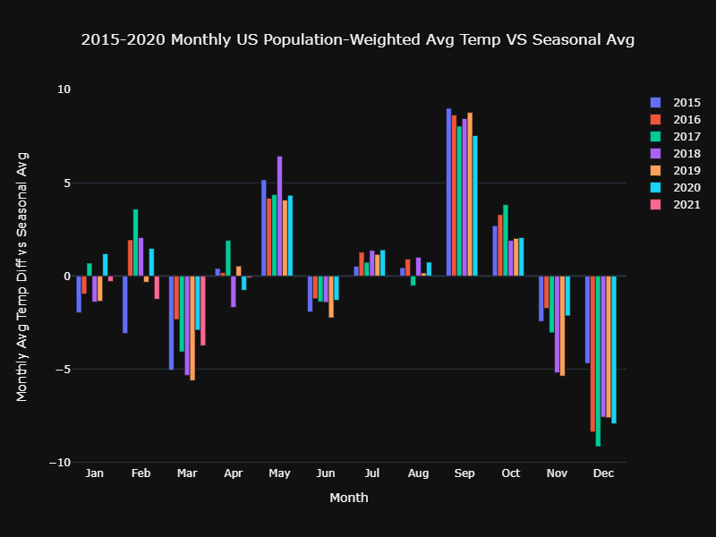

# BP22_Twitter_Challenge
Population Weighted Temperature Time series and Data Viz

US Population-Weighted Temperature TimeSeries: Daily Min, Mean, and Max

### Data Visualizations Part 1:

### Data Visualizations Part 2:
Someone who wants to view the monthly avg, min, and max

